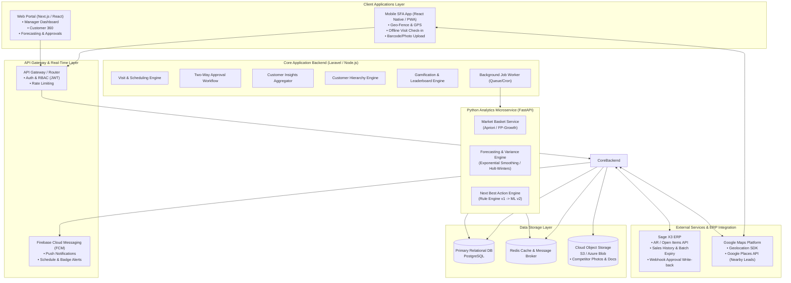
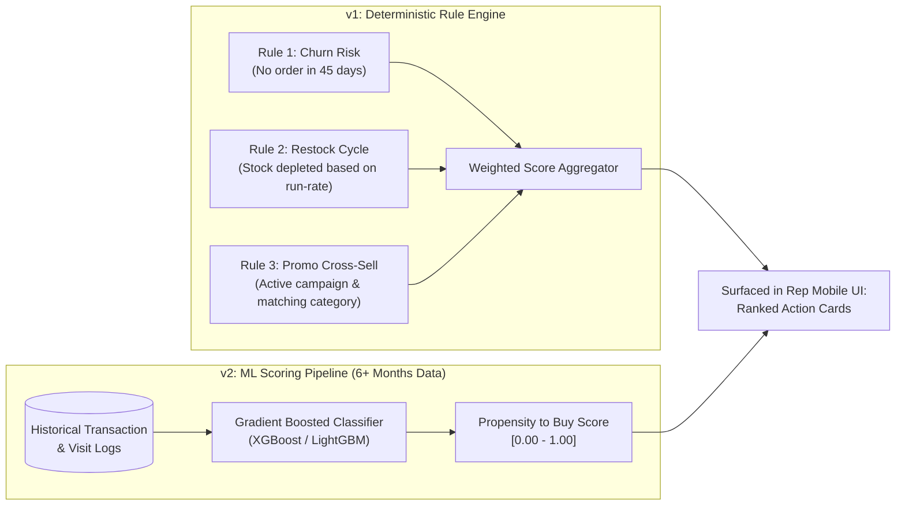
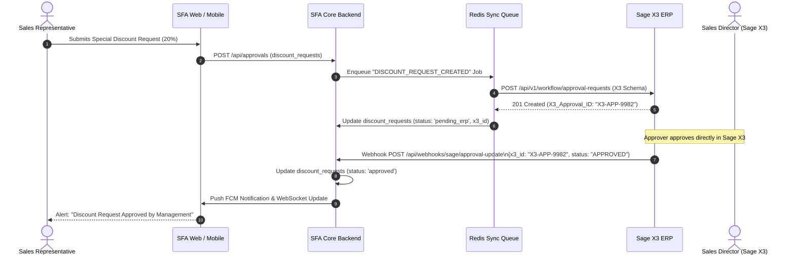

# SFA Platform — Extended Scope Technical Architecture & Implementation Plan

> **Document Version:** 1.0.0  
> **Status:** Approved Technical Specification  
> **Scope:** 12 Extended Scope Deliverables  
> **Target Audience:** Engineering Leads, Solution Architects, Project Managers, Client Technical Stakeholders  

---

## Table of Contents

1. [Executive Summary & System Architecture](#1-executive-summary--system-architecture)
2. [End-to-End System Architecture Diagram](#2-end-to-end-system-architecture-diagram)
3. [Detailed Build Specifications for 12 Extended Scope Items](#3-detailed-build-specifications-for-12-extended-scope-items)
   - [Item 1: Visit Time Scheduling (alongside Date Scheduling)](#item-1-visit-time-scheduling-alongside-date-scheduling)
   - [Item 2: Geo-Fencing Controls & Visit Compliance Tracking](#item-2-geo-fencing-controls--visit-compliance-tracking)
   - [Item 3: Customer 360 Insights Panel](#item-3-customer-360-insights-panel)
   - [Item 4: Enhanced Forecasting Engine (SKU-Level & Rep Performance)](#item-4-enhanced-forecasting-engine-sku-level--rep-performance)
   - [Item 5: Algorithmic Transparency: AI/ML Forecasting & Recommendation Logic](#item-5-algorithmic-transparency-aiml-forecasting--recommendation-logic)
   - [Item 6: “Next Best Action” (NBA) Recommendation Engine](#item-6-next-best-action-nba-recommendation-engine)
   - [Item 7: Market Basket Analysis & Cross-Selling Microservice](#item-7-market-basket-analysis--cross-selling-microservice)
   - [Item 8: Competitor Intelligence Capture & Reporting](#item-8-competitor-intelligence-capture--reporting)
   - [Item 9: Two-Way Sage X3 Integration for Approvals & Live Updates](#item-9-two-way-sage-x3-integration-for-approvals--live-updates)
   - [Item 10: Enhanced KPI Dashboards, Leaderboards & Gamification](#item-10-enhanced-kpi-dashboards-leaderboards--gamification)
   - [Item 11: Customer Hierarchy & Parent/Child Account Roll-Up](#item-11-customer-hierarchy--parentchild-account-roll-up)
   - [Item 12: Map Intelligence & Nearby Lead Generation (Google Places)](#item-12-map-intelligence--nearby-lead-generation-google-places)
4. [Consolidated Database Schema & Data Models](#4-consolidated-database-schema--data-models)
5. [Program Delivery Plan, Phases & Complexity Matrix](#5-program-delivery-plan-phases--complexity-matrix)
6. [Client Integration Prerequisites & Infrastructure Checklist](#6-client-integration-prerequisites--infrastructure-checklist)

---

## 1. Executive Summary & System Architecture

This specification document outlines the concrete implementation approach for the **12 Extended Scope Items** of the Sales Force Automation (SFA) platform. It provides a blueprint for engineering teams and client stakeholders, transitioning from high-level feasibility ratings to architectural definitions, data models, API contracts, and phased execution roadmaps.

### Architectural Tenets
- **Hybrid Core Backend & Specialized AI Microservices:** The platform retains the existing primary transactional backend (Laravel / Node.js Next.js) while introducing an isolated **Python Analytics & ML Microservice** (FastAPI, Pandas, mlxtend, Scikit-learn) for heavy computational tasks like Market Basket Analysis (FP-Growth) and SKU-level variance modeling.
- **Asynchronous & Resilient ERP Integration:** Two-way integration with **Sage X3** is decoupled via job queues (Redis/BullMQ or Laravel Queues) with exponential backoff and idempotency keys to prevent ERP rate-limiting or downtime from disrupting field sales operations.
- **Offline-First Mobile Capability:** Mobile workflows (Geo-checkin, visit scheduling, competitor intelligence, and cached Customer 360 data) support local caching with background synchronization upon network reconnection.

---

## 2. End-to-End System Architecture Diagram



---

## 3. Detailed Build Specifications for 12 Extended Scope Items

---

### Item 1: Visit Time Scheduling (alongside Date Scheduling)
**Complexity:** `Low` | **Phase:** Phase 1 | **Target Platforms:** Web & Mobile

#### 1.1 Objective
Extend existing date-based visit planning to support discrete time slots (e.g. 10:00 AM – 11:30 AM), automatic conflict detection across customer visits, and automated push notifications ahead of scheduled visits.

#### 1.2 Data Model Changes
Add `scheduled_time_start`, `scheduled_time_end`, and `duration_minutes` to the `visits` table:
```sql
ALTER TABLE visits 
ADD COLUMN IF NOT EXISTS scheduled_time_start TIME,
ADD COLUMN IF NOT EXISTS scheduled_time_end TIME,
ADD COLUMN IF NOT EXISTS duration_minutes INTEGER DEFAULT 60,
ADD COLUMN IF NOT EXISTS reminder_sent BOOLEAN DEFAULT FALSE;

CREATE INDEX idx_visits_rep_datetime ON visits(rep_id, scheduled_date, scheduled_time_start);
```

#### 1.3 Conflict Detection Algorithm
Before inserting or updating a visit record:
```
Overlap Condition:
(new_start < existing_end) AND (new_end > existing_start)
WHERE rep_id = :rep_id 
  AND scheduled_date = :scheduled_date 
  AND id != :current_visit_id 
  AND status NOT IN ('cancelled', 'completed')
```
- If conflict is detected, the API returns `409 Conflict` with conflicting visit details.
- Reps receive an override prompt with mandatory manager justification if overlapping visits are intentional.

#### 1.4 Push Notification Pipeline
- A cron job (`check-upcoming-visits`) runs every 5 minutes on the backend worker.
- Queries visits where `scheduled_date = CURRENT_DATE` and `scheduled_time_start BETWEEN NOW() AND NOW() + INTERVAL '30 MINUTE'` and `reminder_sent = FALSE`.
- Dispatches FCM push notification payload to the assigned representative's device token.

---

### Item 2: Geo-Fencing Controls & Visit Compliance Tracking
**Complexity:** `Low` | **Phase:** Phase 1 | **Target Platforms:** Mobile (Native) & Web Manager Dashboard

#### 2.1 Objective
Enhance radius-based check-in verification with configurable per-customer/territory radius thresholds, manager override audit logs, and a manager compliance dashboard.

#### 2.2 Configurable Radius & Verification Logic
- Default radius: `150 meters` (configurable per customer in `customers.geofence_radius_meters`).
- Great-Circle Distance calculation using the **Haversine formula** (executed client-side for instant feedback, validated server-side upon check-in):
$$d = 2r \arcsin \left( \sqrt{ \sin^2\left(\frac{\Delta \phi}{2}\right) + \cos(\phi_1)\cos(\phi_2)\sin^2\left(\frac{\Delta \lambda}{2}\right) } \right)$$

#### 2.3 Geo-Fence Override & Audit Trail
When check-in distance exceeds `geofence_radius_meters`:
1. Mobile UI prompts for an **Override Reason** (e.g. *Client Meeting at Alternate Office*, *GPS Inaccuracy*, *Large Factory Campus*).
2. The record is flagged with `is_geofence_compliant = FALSE`.
3. Check-in event is recorded in `visit_compliance_logs` with GPS coordinates, distance deviation in meters, and justification.
4. Managers view these deviations in the **Compliance Audit Dashboard** with map pin comparisons (Customer Pin vs. Rep Actual Check-in Pin).

---

### Item 3: Customer 360 Insights Panel
**Complexity:** `Medium` | **Phase:** Phase 2 | **Target Platforms:** Web & Mobile

#### 3.1 Objective
Provide sales reps and managers with a real-time, aggregated Customer 360 panel directly on the customer detail view, synthesizing Sage X3 data without burdening the ERP with live queries.

#### 3.2 Key Data Points & Ingestion Cadence
| Insight Metric | Source Scope | Sync Cadence | Caching Strategy |
| :--- | :--- | :--- | :--- |
| **AR Outstanding & Overdue Aging** | Sage X3 AR / Open Items API | Daily / Hourly batch | Redis Key: `cust:ar:{id}` (TTL: 6h) |
| **Buying History & Order Frequency** | Sage X3 Sales History API | Nightly batch | Stored in `customer_sales_summary` |
| **Frequent SKU Reorder Matrix** | Aggregated Order Items | Weekly computation | Stored in `customer_top_products` |
| **Lot/Batch Expiry Alerts** | Sage X3 Lot Master API | Daily batch | Threshold: `< 45 days to expiry` |
| **Slow-Moving Stock Alerts** | Stock Movement API | Weekly batch | Threshold: `No re-order in > 60 days` |

#### 3.3 UI Component Specification
- **Summary Cards:** Total Outstanding Balance, Credit Limit Utilization %, Overdue (> 30/60/90 days), Last Order Date.
- **Smart Tags:** `[🚨 Overdue Payment]`, `[⚠️ Expiring Stock in Warehouse]`, `[🔄 Reorder Due: Fabbri Syrup]`.
- **Top 5 Reordered Products Table:** Product SKU, Last Ordered Quantity, Average Order Frequency (days), Recommended Reorder Date.

---

### Item 4: Enhanced Forecasting Engine (SKU-Level & Rep Performance)
**Complexity:** `High` | **Phase:** Phase 5 | **Target Platforms:** Web Analytics & Manager Portal

#### 4.1 Objective
Upgrade high-level aggregate forecasting into SKU-level granular forecasting with variance tracking, historical accuracy scoring over time, and a salesperson forecast-performance scorecard.

#### 4.2 Calculation Engine & Variance Analysis
- **Forecast Baseline:** Ingested from Netstock / Sage X3 or calculated via seasonal exponential smoothing.
- **Variance Metric Calculation:**
$$\text{Variance \%} = \frac{\text{Actual Sales} - \text{Committed Forecast}}{\text{Committed Forecast}} \times 100$$
$$\text{Accuracy Score (WMAPE)} = 100 - \left( \frac{\sum |\text{Actual}_i - \text{Forecast}_i|}{\sum \text{Actual}_i} \times 100 \right)$$
- **Granular Dimensions:** SKU, Product Category, Territory, Sales Representative, Time Bucket (Monthly / Quarterly).

#### 4.3 Salesperson Performance Scorecard
- Historical Accuracy Trend (trailing 6 months rolling accuracy chart).
- Forecast Bias Indicator: Categorizes reps as *Over-Optimistic* (Consistently Forecasts > Actual) or *Conservative* (Consistently Forecasts < Actual).
- Target Achievement vs. Forecast Commitment scatter matrix.

---

### Item 5: Algorithmic Transparency: AI/ML Forecasting & Recommendation Logic
**Complexity:** `Documentation & Framework` | **Phase:** Phase 3 & 5

#### 5.1 Objective
Provide full transparency and auditability for all automated suggestions and forecasts, building trust among sales reps, managers, and executive leadership.

#### 5.2 Algorithmic Logic Breakdown
1. **Forecasting Transparency:**
   - *Phase 1 Baseline:* Triple Exponential Smoothing (Holt-Winters) handling trend and 12-month seasonality.
   - *Confidence Interval Calculation:* Upper/Lower 80% & 95% prediction intervals based on root-mean-square error (RMSE).
   - Every forecast UI element includes a **"Why this number?"** tooltip displaying: historical weightings, trend multiplier, and base data points.
2. **Recommendation Reason Badges:**
   - Every recommendation is tagged with its rule origin:
     - `[Rule: Inactivity]` — Customer has not purchased product X in 35 days (historical cycle: 28 days).
     - `[Rule: High Margin Promotion]` — Focus campaign product with > 25% gross margin.
     - `[Model: Affinity]` — Market basket affinity score > 0.65 with current cart items.

---

### Item 6: “Next Best Action” (NBA) Recommendation Engine
**Complexity:** `High` | **Phase:** Phase 5 | **Target Platforms:** Mobile Visit Workflow & Order Creation

#### 6.1 Objective
Deliver proactive, ranked actionable suggestions to sales representatives before and during customer visits to maximize order value and customer retention.

#### 6.2 Two-Stage Evolution Architecture



#### 6.3 Rep Mobile UI Interaction
- Displayed at the top of the **Visit Execution Screen**:
  - **Action Card 1:** *Reorder Alert: Dawn Chocolate Frosting (Customer runs out in ~4 days).* `[One-Tap Add to Order]`
  - **Action Card 2:** *Promo Pitch: Introduce Amarena Fabbri Sauces (15% Campaign Discount).* `[View Pitch Script & Samples]`
  - **Action Card 3:** *Payment Follow-up: Invoice #INV-2024-88 is 12 days overdue.* `[View Invoice PDF]`

---

### Item 7: Market Basket Analysis & Cross-Selling Microservice
**Complexity:** `High` | **Phase:** Phase 5 | **Architecture:** Python Analytics Microservice

#### 7.1 Objective
Identify multi-product purchase patterns ("Customers who bought item A also frequently bought item B and C") and surface real-time cross-sell recommendations during order entry.

#### 7.2 Microservice Architecture & Algorithm
- **Framework:** Python 3.11 + FastAPI + `mlxtend` + Redis.
- **Algorithm:** **FP-Growth (Frequent Pattern Growth)** — chosen over Apriori for $O(N)$ efficiency with large order-line histories.
- **Metrics Tracked:**
  - **Support:** Proportion of transactions containing $\{X, Y\}$.
  - **Confidence:** Probability of purchasing $Y$ given $X$: $P(Y|X)$.
  - **Lift:** Strength of the rule over random coincidence: $\text{Lift}(X \rightarrow Y) = \frac{\text{Confidence}(X \rightarrow Y)}{\text{Support}(Y)}$. (Rules filtered for $\text{Lift} > 1.25$).

#### 7.3 Scheduled Pipeline & API Endpoint
```python
# FastAPI Microservice Endpoint Definition
@app.get("/api/v1/recommendations/cross-sell")
async def get_cross_sell_recommendations(product_ids: List[str], limit: int = 3):
    """
    Returns high-lift cross-sell suggestions based on current basket contents.
    """
    cached_rules = await redis_client.get(f"mba:rules:{','.join(sorted(product_ids))}")
    if cached_rules:
        return json.loads(cached_rules)
    
    recommendations = mba_engine.compute_recommendations(product_ids, top_n=limit)
    return recommendations
```

---

### Item 8: Competitor Intelligence Capture & Reporting
**Complexity:** `Low` | **Phase:** Phase 2 | **Target Platforms:** Mobile Visit Closeout & Web BI Reports

#### 8.1 Objective
Enable field reps to log competitor presence, product pricing, promotions, and shelf-share photos during store visits, feeding an executive competitor dashboard.

#### 8.2 Mobile Workflow & Photo Upload Pipeline
1. During the **Visit Summary / Checkout** step, reps access an optional **Competitor Intel** tab.
2. Rep selects Competitor Brand (from dropdown or adds new), Competitor SKU/Description, Observed Shelf Price, Active Promotions (e.g. *Buy 2 Get 1 Free*), and Estimated Shelf Share %.
3. Rep snaps a shelf photo $\rightarrow$ Image is compressed on-device ($< 1\,\text{MB}$) $\rightarrow$ Uploaded via direct pre-signed URL to S3 / Azure Blob Storage.
4. Submission stored in `competitor_intelligence` table.

#### 8.3 Aggregation & BI Reporting
- **Territory Price Comparison Matrix:** Client SKU Price vs. Average Competitor Shelf Price by region.
- **Competitor Activity Heatmap:** Identifies areas where competitors are running aggressive promotional campaigns.

---

### Item 9: Two-Way Sage X3 Integration for Approvals & Live Updates
**Complexity:** `Medium` | **Phase:** Phase 3 | **Target Platforms:** Core Backend & ERP Middleware

#### 9.1 Objective
Establish bi-directional synchronization between the SFA platform and Sage X3: approval requests raised in the SFA app write into Sage X3, while ERP status modifications trigger real-time updates back in the SFA app.

#### 9.2 Bi-Directional Sequence Flow



#### 9.3 Resilience, Idempotency & Error Handling
- **Idempotency Key:** Every request generated by SFA includes a UUID `idempotency_key` stored in Sage X3 custom tracking field to prevent duplicate order/discount creation.
- **Dead Letter Queue (DLQ):** Failed sync jobs retry 5 times with exponential backoff ($2^n \times 30\,\text{s}$). If unresolved, an alert is sent to the system administrator dashboard.

---

### Item 10: Enhanced KPI Dashboards, Leaderboards & Gamification
**Complexity:** `Low` | **Phase:** Phase 2 | **Target Platforms:** Web Manager Portal & Mobile Rep Dashboard

#### 10.1 Objective
Drive field sales motivation and manager visibility through real-time ranked leaderboards, achievement badges, milestone streaks, and customizable role-based scorecards.

#### 10.2 Gamification & Badge Mechanics
- **Achievement Badges:**
  - 🏆 *Century Club:* Log 100 completed visits in a month.
  - 🎯 *Forecast Master:* Maintain $> 90\%$ forecast accuracy for 3 consecutive months.
  - ⚡ *Lightning Checkout:* Complete 100% geo-compliant check-ins without overrides for 30 days.
  - 📦 *Cross-Sell Champion:* Successfully pitch and close $\ge 15$ recommended basket items.
- **Streak Tracker:** Tracks consecutive days with 100% planned visit completion.

#### 10.3 Leaderboard Scoring Algorithm
$$\text{Leaderboard Points} = (\text{Orders Count} \times 50) + (\text{Visit Compliance Rate} \times 200) + (\text{Sales Value (AED)} / 1000 \times 10) + (\text{New Leads Converted} \times 100)$$

---

### Item 11: Customer Hierarchy & Parent/Child Account Roll-Up
**Complexity:** `Medium` | **Phase:** Phase 3 | **Target Platforms:** Web & Mobile

#### 11.1 Objective
Support complex multi-tier customer structures (e.g. Corporate Headquarters $\rightarrow$ Regional Holding $\rightarrow$ Individual Branch/Outlet) with consolidated credit tracking, aggregated order volumes, and individual store delivery points.

#### 11.2 Hierarchy Schema & Roll-Up Logic
```sql
ALTER TABLE customers
ADD COLUMN IF NOT EXISTS parent_id UUID REFERENCES customers(id) ON DELETE SET NULL,
ADD COLUMN IF NOT EXISTS hierarchy_level VARCHAR(20) DEFAULT 'branch' CHECK (hierarchy_level IN ('headquarters', 'regional', 'branch')),
ADD COLUMN IF NOT EXISTS credit_limit_scope VARCHAR(20) DEFAULT 'individual' CHECK (credit_limit_scope IN ('individual', 'consolidated_parent'));

CREATE INDEX idx_customers_parent ON customers(parent_id);
```

#### 11.3 Consolidated Balance Calculation (Recursive SQL View)
```sql
CREATE OR REPLACE VIEW view_customer_hierarchy_rollups AS
WITH RECURSIVE customer_tree AS (
    SELECT id AS root_id, id, name, parent_id, credit_limit
    FROM customers
    WHERE parent_id IS NULL -- Roots / HQs
    UNION ALL
    SELECT ct.root_id, c.id, c.name, c.parent_id, c.credit_limit
    FROM customers c
    INNER JOIN customer_tree ct ON c.parent_id = ct.id
)
SELECT 
    ct.root_id AS hq_customer_id,
    COUNT(DISTINCT ct.id) AS total_outlets,
    COALESCE(SUM(o.total_amount), 0) AS total_group_order_volume,
    COALESCE(SUM(o.total_amount) FILTER (WHERE o.status = 'pending_payment'), 0) AS consolidated_outstanding_ar
FROM customer_tree ct
LEFT JOIN orders o ON o.customer_id = ct.id
GROUP BY ct.root_id;
```

---

### Item 12: Map Intelligence & Nearby Lead Generation (Google Places)
**Complexity:** `Medium` | **Phase:** Phase 5 | **Target Platforms:** Mobile Map & Rep Territory Planner

#### 12.1 Objective
Empower field sales representatives to discover prospective new accounts (e.g. Bakeries, Cafes, Restaurants, Hotels) near their current GPS position or planned route using the **Google Places API (New)**.

#### 12.2 Search & Filtering Workflow
1. Rep opens **Map Intelligence View** on mobile.
2. Selects search radius (e.g. $1\,\text{km}$, $3\,\text{km}$, $5\,\text{km}$) and business category keywords (`bakery`, `patisserie`, `hotel pastry kitchen`, `cafe`).
3. App queries the backend proxy endpoint (`GET /api/leads/nearby?lat=...&lng=...&radius=...&type=bakery`).
4. **De-duplication Check:** The backend matches Google Places `place_id` against existing `customers` and `leads` tables:
   - Green Pin: Existing Active Customer.
   - Blue Pin: Registered Lead in Pipeline.
   - 🌟 Gold Star Pin: **Uncontacted Google Places Prospect**.
5. Rep taps Gold Star $\rightarrow$ Clicks **"Convert to Lead"** $\rightarrow$ Pre-populates business name, address, phone number, and Google ratings into the lead creation form.

---

## 4. Consolidated Database Schema & Data Models

Below is the complete database migration script for the new tables and attributes supporting all 12 items:

```sql
-- ====================================================================
-- EXTENDED SCOPE CONSOLIDATED MIGRATIONS
-- ====================================================================

-- 1. Visit Time & Compliance Extensions
ALTER TABLE visits 
ADD COLUMN IF NOT EXISTS scheduled_time_start TIME,
ADD COLUMN IF NOT EXISTS scheduled_time_end TIME,
ADD COLUMN IF NOT EXISTS duration_minutes INTEGER DEFAULT 60,
ADD COLUMN IF NOT EXISTS is_geofence_compliant BOOLEAN DEFAULT TRUE,
ADD COLUMN IF NOT EXISTS check_in_distance_meters NUMERIC(10,2),
ADD COLUMN IF NOT EXISTS geofence_override_reason TEXT,
ADD COLUMN IF NOT EXISTS reminder_sent BOOLEAN DEFAULT FALSE;

ALTER TABLE customers 
ADD COLUMN IF NOT EXISTS geofence_radius_meters INTEGER DEFAULT 150,
ADD COLUMN IF NOT EXISTS parent_id UUID REFERENCES customers(id) ON DELETE SET NULL,
ADD COLUMN IF NOT EXISTS hierarchy_level VARCHAR(20) DEFAULT 'branch',
ADD COLUMN IF NOT EXISTS credit_limit_scope VARCHAR(20) DEFAULT 'individual';

-- 2. Competitor Intelligence Table
CREATE TABLE IF NOT EXISTS competitor_intelligence (
    id UUID PRIMARY KEY DEFAULT gen_random_uuid(),
    visit_id UUID REFERENCES visits(id) ON DELETE SET NULL,
    customer_id UUID REFERENCES customers(id) ON DELETE CASCADE,
    rep_id UUID REFERENCES users(id) ON DELETE SET NULL,
    competitor_name VARCHAR(255) NOT NULL,
    product_category VARCHAR(100),
    competitor_product_name VARCHAR(255),
    observed_price NUMERIC(10,2),
    currency VARCHAR(10) DEFAULT 'AED',
    promotion_details TEXT,
    shelf_share_percentage INTEGER CHECK (shelf_share_percentage BETWEEN 0 AND 100),
    photo_url TEXT,
    notes TEXT,
    created_at TIMESTAMP WITH TIME ZONE DEFAULT NOW()
);

-- 3. SKU-Level Forecast Variance Tracking
CREATE TABLE IF NOT EXISTS forecast_sku_performance (
    id UUID PRIMARY KEY DEFAULT gen_random_uuid(),
    rep_id UUID REFERENCES users(id) ON DELETE CASCADE,
    product_id UUID REFERENCES products(id) ON DELETE CASCADE,
    period_month DATE NOT NULL, -- e.g. 2026-09-01
    committed_forecast_units INTEGER NOT NULL DEFAULT 0,
    actual_sold_units INTEGER NOT NULL DEFAULT 0,
    variance_units INTEGER GENERATED ALWAYS AS (actual_sold_units - committed_forecast_units) STORED,
    variance_percentage NUMERIC(6,2),
    accuracy_score NUMERIC(5,2),
    created_at TIMESTAMP WITH TIME ZONE DEFAULT NOW(),
    UNIQUE(rep_id, product_id, period_month)
);

-- 4. Market Basket Association Rules Cache Table
CREATE TABLE IF NOT EXISTS market_basket_rules (
    id UUID PRIMARY KEY DEFAULT gen_random_uuid(),
    antecedent_product_ids JSONB NOT NULL, -- e.g. ["uuid1", "uuid2"]
    consequent_product_ids JSONB NOT NULL, -- e.g. ["uuid3"]
    support NUMERIC(6,4) NOT NULL,
    confidence NUMERIC(6,4) NOT NULL,
    lift NUMERIC(6,4) NOT NULL,
    computed_at TIMESTAMP WITH TIME ZONE DEFAULT NOW()
);

-- 5. Gamification & Rep Scorecards
CREATE TABLE IF NOT EXISTS rep_gamification_profiles (
    user_id UUID PRIMARY KEY REFERENCES users(id) ON DELETE CASCADE,
    current_points INTEGER DEFAULT 0,
    current_streak_days INTEGER DEFAULT 0,
    monthly_rank INTEGER,
    total_badges_earned INTEGER DEFAULT 0,
    updated_at TIMESTAMP WITH TIME ZONE DEFAULT NOW()
);

CREATE TABLE IF NOT EXISTS rep_badges (
    id UUID PRIMARY KEY DEFAULT gen_random_uuid(),
    user_id UUID REFERENCES users(id) ON DELETE CASCADE,
    badge_code VARCHAR(50) NOT NULL,
    badge_title VARCHAR(100) NOT NULL,
    badge_icon VARCHAR(50),
    awarded_at TIMESTAMP WITH TIME ZONE DEFAULT NOW()
);

-- 6. External ERP Sync Audit Log
CREATE TABLE IF NOT EXISTS erp_sync_logs (
    id UUID PRIMARY KEY DEFAULT gen_random_uuid(),
    entity_type VARCHAR(50) NOT NULL, -- 'order', 'discount_request', 'customer'
    entity_id UUID NOT NULL,
    direction VARCHAR(10) NOT NULL CHECK (direction IN ('OUTBOUND', 'INBOUND')),
    erp_reference_id VARCHAR(100),
    status VARCHAR(20) NOT NULL, -- 'SUCCESS', 'FAILED', 'PENDING'
    payload JSONB,
    response_payload JSONB,
    error_message TEXT,
    created_at TIMESTAMP WITH TIME ZONE DEFAULT NOW()
);
```

---

## 5. Program Delivery Plan, Phases & Complexity Matrix

| Phase | Scope Deliverables | Items Covered | Complexity | Dependencies |
| :--- | :--- | :--- | :---: | :--- |
| **Phase 1** | Core Logistics & Geofencing Enhancements | Item 1, Item 2 | `Low` | Existing GPS & Visit Models |
| **Phase 2** | Customer 360, Competitor Intel & Gamification | Item 3, Item 8, Item 10 | `Low – Med` | Cloud Object Storage, Sage Read APIs |
| **Phase 3** | Customer Hierarchy & Two-Way ERP Sync | Item 9, Item 11 | `Medium` | Client Sage X3 Approval Webhook Endpoints |
| **Phase 4** | Technical Whitepaper & Algorithmic Notes | Item 5 | `Doc` | Discovery Sign-off on Formula Baselines |
| **Phase 5** | Advanced Analytics, AI / ML & Map Intelligence | Item 4, Item 6, Item 7, Item 12 | `High` | Python FastAPI Microservice, Google Places API |

---

## 6. Client Integration Prerequisites & Infrastructure Checklist

To ensure execution on schedule, the following dependencies must be provisioned and confirmed by the client technical team:

1. **Sage X3 ERP API Availability:**
   - [ ] AR / Open Items Read Endpoint (for Customer 360).
   - [ ] Sales History & Order Lines Ingestion Endpoint.
   - [ ] Stock Batch / Lot Expiry Read Endpoint.
   - [ ] Two-Way Approval Request Webhook & Status Write-back Endpoint.
2. **Third-Party Cloud Services:**
   - [ ] **Google Cloud Platform:** Google Maps Platform project with *Places API (New)*, *Maps JavaScript API*, and *Geolocation API* enabled with billing account attached.
   - [ ] **Firebase Project:** Firebase Cloud Messaging (FCM) Service Account credentials for push notification triggers.
   - [ ] **Cloud Storage:** S3 / Azure Blob Storage bucket for competitor photo uploads and generated document PDFs.
3. **Analytics Infrastructure:**
   - [ ] Dedicated containerized environment (AWS ECS / Azure App Service / Docker) to host the Python FastAPI Market Basket & Forecasting Microservice.

---
*End of Extended Scope Technical Architecture Plan.*
