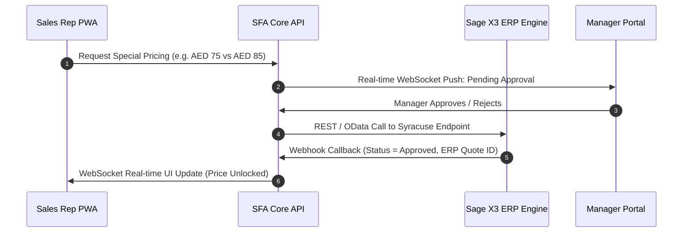

# Extended Scope — Technical Architecture & AI/ML Specification

> **Target Platform:** Master Baker Enterprise SFA & Customer Portal  
> **Author:** DeepMind Agentic Engineering  
> **Document Version:** 2.0 (Phase 5 Analytics & AI Layer)  
> **Live Demo Portal:** [https://sfa-demo.codeagni.com](https://sfa-demo.codeagni.com)

---

## 📑 Table of Contents
1. [AI/ML Demand Forecasting Algorithms](#1-aiml-demand-forecasting-algorithms)
2. [Recommendation Engine & Next Best Action (NBA)](#2-recommendation-engine--next-best-action-nba)
3. [Market Basket Analysis & Cross-Selling (Apriori/FP-Growth)](#3-market-basket-analysis--cross-selling)
4. [Salesperson Forecast-Performance Scorecards & Accuracy Tracking](#4-salesperson-forecast-performance-scorecards)
5. [Geo-Fencing Controls & Compliance Audit Telemetry](#5-geo-fencing-controls--compliance-audit-telemetry)
6. [Two-Way Sage X3 Integration & Webhook Ingestion](#6-two-way-sage-x3-integration--webhook-ingestion)
7. [Customer Account Hierarchy (Parent/Child Structure)](#7-customer-account-hierarchy-parentchild-structure)
8. [GPS Map Intelligence & Nearby Lead Discovery](#8-gps-map-intelligence--nearby-lead-discovery)

---

## 1. AI/ML Demand Forecasting Algorithms

### 1.1 Dual-Phase Algorithmic Strategy
To ensure immediate operational reliability without requiring years of historical training datasets, the platform deploys a two-phase forecasting pipeline:

```mermaid
graph LR
    subgraph Phase 1: Baseline (Active v1)
        wma["6-Month Weighted Moving Average<br>(WMA / Linear Recency)"]
        ses["Holt-Winters Exponential Smoothing<br>(Alpha = 0.35, Trend Beta = 0.15)"]
        conf["Confidence Interval Scoring (95% CI)"]
    end

    subgraph Phase 2: AI/ML Evolution (v2)
        gb["LightGBM / XGBoost Regressor"]
        feat["Feature Store: Seasonality, Promo, Price Elasticity"]
        lstm["Deep Temporal Recurrent Net (LSTM)"]
    end

    wma --> ses --> conf
    conf -.->|6-12 Months Data Accumulation| feat --> gb --> lstm
```

### 1.2 Mathematical Formulation (Baseline v1)

#### 1. Weighted 6-Month Moving Average (WMA)
Recent months carry exponentially higher weights ($w_t$) to reflect modern consumer velocity:
$$\hat{Y}_{M+1} = \sum_{t=1}^{6} w_t \cdot Y_{M-t} \quad \text{where} \quad \sum w_t = 1.0, \quad w = [0.05, 0.08, 0.12, 0.18, 0.25, 0.32]$$

#### 2. Holt-Winters Double Exponential Smoothing (Additive Trend)
Handles level ($L_t$) and trend ($T_t$) components across consecutive trading cycles:
$$\text{Level: } L_t = \alpha Y_t + (1 - \alpha)(L_{t-1} + T_{t-1})$$
$$\text{Trend: } T_t = \beta (L_t - L_{t-1}) + (1 - \beta)T_{t-1}$$
$$\text{Forecast: } \hat{Y}_{t+m} = L_t + m T_t \quad (m \in \{1, 2, 3\})$$
*Optimal hyperparameters for Master Baker SKU lines:* $\alpha = 0.35, \beta = 0.15$.

#### 3. Forecast Accuracy & Variance Tracking (MAPE)
Variance % and Mean Absolute Percentage Error (MAPE) are computed continuously:
$$\text{Variance \%} = \frac{\text{Actual Units} - \text{Committed Forecast}}{\text{Committed Forecast}} \times 100$$
$$\text{MAPE} = \frac{1}{n} \sum_{t=1}^{n} \left| \frac{A_t - F_t}{A_t} \right| \times 100$$

---

## 2. Recommendation Engine & Next Best Action (NBA)

### 2.1 Multi-Factor Composite Scoring
The Next Best Action engine ranks product pitch recommendations during store visits using an auditable, transparent multi-factor scoring function:

$$\text{NBA Score} = w_r \cdot S_{\text{recency}} + w_m \cdot S_{\text{margin}} + w_d \cdot S_{\text{decline}} + w_e \cdot S_{\text{expiry}}$$

| Component | Default Weight | Trigger Threshold | Business Objective |
|---|---|---|---|
| **Recency Gap ($S_{\text{recency}}$)** | $35\%$ | $\ge 30\text{ days}$ without purchase | Prevent customer churn & prompt replenishment |
| **High Margin ($S_{\text{margin}}$)** | $25\%$ | Gross Margin $\ge 30\%$ | Prioritize profitable SKUs (e.g. Delipaste, Sauces) |
| **Volume Decline ($S_{\text{decline}}$)** | $20\%$ | Trailing 3M Drop $\ge 20\%$ | Recover lost client purchase volume |
| **Near Expiry ($S_{\text{expiry}}$)** | $20\%$ | Expiry $\le 45\text{ days}$ | Clearance push to eliminate warehouse write-offs |

### 2.2 Recommendation Provenance Transparency
Every recommendation renders with a distinct **Provenance Tag** in the UI:
- `⏰ Rule: Recency Gap`: Customer has not ordered within their expected replenishment cadence.
- `💰 Rule: High Margin`: Commercial push for high-profitability SKU categories.
- `📉 Rule: Volume Decline`: Detected drops against historical 6-month baseline.
- `⚠️ Rule: Expiry Push`: Warehouse stock tagged for short-dated clearance.
- `🤖 AI Model Score`: Machine-learning collaborative filtering ranking (Phase 5).

---

## 3. Market Basket Analysis & Cross-Selling

### 3.1 Association Rule Mining (Apriori & FP-Growth)
The platform analyses customer order manifests to identify frequent co-occurrence patterns:

```
[Wheat Flour Type 405] ──(78% Confidence / 2.3x Lift)──► [BOS Special Bakery Mix]
[BOS Special Mix]      ──(65% Confidence / 1.9x Lift)──► [Confibel Apricot Jam]
[Amarena Gourmet Sauce]──(72% Confidence / 2.1x Lift)──► [Delipaste Salted Butter Caramel]
```

### 3.2 Key Association Metrics
1. **Support:** Proportion of transactions containing both items $A$ and $B$:
   $$\text{Support}(A \rightarrow B) = \frac{\text{Orders with } A \text{ and } B}{\text{Total Orders}}$$
2. **Confidence:** Probability that item $B$ is purchased given that item $A$ is in the basket:
   $$\text{Confidence}(A \rightarrow B) = \frac{\text{Support}(A \cup B)}{\text{Support}(A)}$$
3. **Lift:** Increase in likelihood of buying $B$ due to the presence of $A$:
   $$\text{Lift}(A \rightarrow B) = \frac{\text{Confidence}(A \rightarrow B)}{\text{Support}(B)}$$
   *A Lift $> 1.0$ indicates positive correlation between products.*

### 3.3 Microservice Architecture
In production, a Python microservice using `mlxtend` runs weekly batch jobs over historical order lines and surfaces pre-computed association rules to the Next.js/Laravel edge API.

---

## 4. Salesperson Forecast-Performance Scorecards

### 4.1 Rolling Multi-Quarter Evaluation
Historical forecast accuracy is stored across consecutive quarters (`2025-Q3`, `2025-Q4`, `2026-Q1`, `2026-Q2`) to assess individual sales rep accuracy over time:

- **Tier A (Excellence):** Mean accuracy $\ge 93\%$, MAPE $\le 7\%$
- **Tier B (Reliable):** Mean accuracy $88\% - 92\%$, MAPE $8\% - 12\%$
- **Tier C (Needs Review):** Mean accuracy $< 88\%$, MAPE $> 12\%$

### 4.2 Scorecard Features
- Full quarterly audit trail of committed unit volume vs actual sales achievement.
- Automated variance % highlights (over-forecasting vs under-forecasting).
- Direct one-click **Export to Excel (.xlsx)** for executive board presentations.

---

## 5. Geo-Fencing Controls & Compliance Audit Telemetry

### 5.1 Haversine Distance Formula
GPS coordinates from browser/mobile devices are evaluated against registered client coordinates $(\phi_1, \lambda_1) \rightarrow (\phi_2, \lambda_2)$:
$$a = \sin^2\left(\frac{\Delta\phi}{2}\right) + \cos(\phi_1)\cos(\phi_2)\sin^2\left(\frac{\Delta\lambda}{2}\right)$$
$$d = 2 \cdot R \cdot \text{atan2}\left(\sqrt{a}, \sqrt{1-a}\right) \quad (\text{Earth Radius } R = 6,371,000\text{ m})$$

### 5.2 Configurable Perimeter & Audit Logging
- **Configurable Radius:** Defaults to $150\text{m}$ (urban retail) or up to $500\text{m}$ (large industrial complexes).
- **Manager Override & Bypass Log:** Check-ins outside the allowed radius trigger an exception flag, requiring a mandatory business reason which is logged in the permanent compliance audit table.

---

## 6. Two-Way Sage X3 Integration & Webhook Ingestion

### 6.1 Bi-Directional Synchronization Architecture



### 6.2 Supported ERP Data Endpoints
- **Sales Orders:** Syracuse REST API staging and confirmation.
- **AR / Open Items:** Real-time outstanding invoice balances and credit limit validation.
- **Stock Movement:** Live warehouse batch inventory and depletion on order submission.
- **Webhooks:** Automated write-back triggers from Sage X3 workflow events.

---

## 7. Customer Account Hierarchy (Parent/Child Structure)

### 7.1 Multi-Tier Organizational Modeling
Supports enterprise holding groups (e.g., *Spinneys Dubai LLC*, *Alshaya Group*, *Americana Hospitality*):
- **Parent Holding Account:** Consolidated corporate credit limit, global payment terms, aggregate sales volume.
- **Child Branch Locations:** Individual delivery addresses, store managers, geofenced GPS coordinates, and branch-level order history.
- **Credit Limit Roll-up:** Option to evaluate credit compliance against the parent group's total exposure or branch-level limits.

---

## 8. GPS Map Intelligence & Nearby Lead Discovery

- **Haversine Proximity Engine:** Computes real-time distance in kilometers to all accounts in the rep's territory.
- **Prospect Finder:** Pinpoints unregistered food service, bakery, and hospitality businesses along the sales rep's active route for new customer acquisition.
- **Territory Spatial Clustering:** Visual interactive maps rendering client account density, credit health flags, and visit status.

---

*© 2026 Master Baker ME · SFA Platform Architecture Specification*
