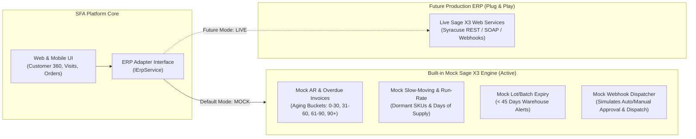
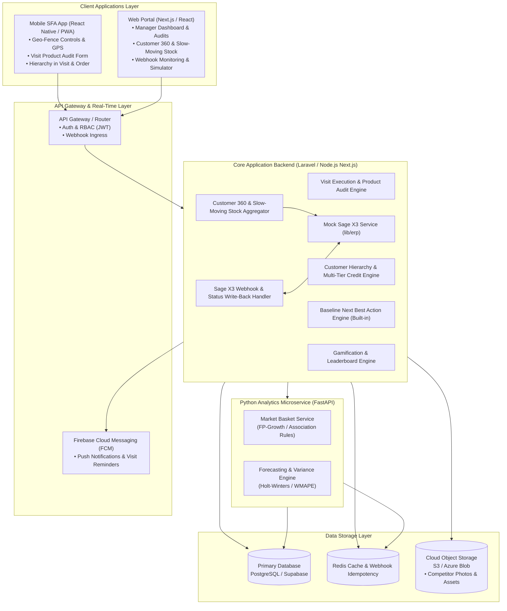

# SFA Platform — Extended Scope Technical Architecture & Implementation Plan

> **Document Version:** 2.1.0 (Sage X3 Mock & Simulation Architecture)  
> **Status:** Approved Technical Specification  
> **Target Audience:** Engineering Leads, Solution Architects, Project Managers, Client Technical Stakeholders  

---

## Table of Contents

1. [Executive Summary & Scope Refinements](#1-executive-summary--scope-refinements)
2. [Sage X3 Mocking & Simulation Architecture](#2-sage-x3-mocking--simulation-architecture)
3. [End-to-End System Architecture Diagram](#3-end-to-end-system-architecture-diagram)
4. [Refined Build Specifications](#4-refined-build-specifications)
   - [Item 1: Visit Time Scheduling & In-Store Product Audit Form](#item-1-visit-time-scheduling--in-store-product-audit-form)
   - [Item 2: Geo-Fencing Controls & Compliance Mechanisms](#item-2-geo-fencing-controls--compliance-mechanisms)
   - [Item 3: Customer 360 Insights Panel & Slow-Moving Stock Metrics](#item-3-customer-360-insights-panel--slow-moving-stock-metrics)
   - [Item 4: Enhanced Forecasting Engine (SKU-Level & Rep Performance)](#item-4-enhanced-forecasting-engine-sku-level--rep-performance)
   - [Item 5: Algorithmic Logic Specification (Forecasting & Recommendation Models)](#item-5-algorithmic-logic-specification-forecasting--recommendation-models)
   - [Item 6: “Next Best Action” (NBA) Engine (Baseline Architecture & v2 Path)](#item-6-next-best-action-nba-engine-baseline-architecture--v2-path)
   - [Item 7: Market Basket Analysis & Cross-Selling Microservice](#item-7-market-basket-analysis--cross-selling-microservice)
   - [Item 8: Competitor Intelligence Capture & Reporting](#item-8-competitor-intelligence-capture--reporting)
   - [Item 9: Two-Way ERP Integration (Mock Sage X3 Webhooks & Status Write-Back)](#item-9-two-way-erp-integration-mock-sage-x3-webhooks--status-write-back)
   - [Item 10: Enhanced KPI Dashboards, Leaderboards & Gamification](#item-10-enhanced-kpi-dashboards-leaderboards--gamification)
   - [Item 11: Customer Hierarchy in Visit & Order Workflows](#item-11-customer-hierarchy-in-visit--order-workflows)
   - [Item 12: Lead Management Scope Re-evaluation](#item-12-lead-management-scope-re-evaluation)
5. [Consolidated Database Schema & Data Models](#5-consolidated-database-schema--data-models)
6. [Program Delivery Plan & Complexity Matrix](#6-program-delivery-plan--complexity-matrix)
7. [Infrastructure & Environment Checklist (100% Mock-Enabled)](#7-infrastructure--environment-checklist-100-mock-enabled)

---

## 1. Executive Summary & Scope Refinements

This specification document details the implementation approach for the Sales Force Automation (SFA) platform, incorporating full **Sage X3 Mock & Simulation Architecture** to ensure 100% independent development and seamless client demonstration:

1. **Sage X3 Decoupling (Full Mocking):** All Sage X3 ERP data points (AR balances, aging buckets, purchase history, batch lot expiry, slow-moving inventory) and two-way webhook status write-backs are handled by a dedicated **Mock Sage X3 Service** built directly into the application.
2. **Customer Visits:** Added a structured **Product Audit & Stock Check form** directly into the active visit workflow.
3. **Customer Insights:** Explicitly detailed **Slow-Moving Stock** metrics, dormancy formulas, and inventory velocity indicators.
4. **AI/ML Forecasting Documentation:** Streamlined to focus strictly on mathematical formulations, error metrics, and algorithmic logic.
5. **Two-Way Integration:** Narrowed strictly to **webhook reception and status write-back** execution.
6. **Geo-Fencing:** Focused on configurable threshold **control mechanisms**, override logging, and compliance audits.
7. **Customer Hierarchy:** Embedded across both **Visit Planning** and **Order Placement** workflows with parent/child credit consolidation.
8. **Next Best Action:** Explicitly documented as **already present** in the baseline platform (rule-based), outlining the optional v2 ML upgrade path.
9. **Lead Generation:** Re-evaluated to focus on **Native Lead Lifecycle Management** within the application.

---

## 2. Sage X3 Mocking & Simulation Architecture

To eliminate any dependency on client ERP availability during development, testing, and stakeholder demos, the platform employs the **Adapter Pattern** with a production-grade **Mock Sage X3 Engine** (`lib/erp/mockSageX3.ts`).



### Key Capabilities of the Built-In Mock ERP Layer:
- **Autonomous Deterministic Data:** Generates realistic credit limits, overdue invoices, and purchase histories tailored per customer ID without requiring external servers.
- **Interactive Webhook Simulator:** Built-in API route (`POST /api/mock-sage/webhook-trigger`) allows simulating ERP approval/rejection of discount requests and order fulfillment progression in real time.
- **Zero Rework for Future Integration:** The interface contract (`Customer360MockData`, `CustomerArAging`, `SageWebhookPayload`) matches real-world Sage X3 schemas, ensuring a 1-to-1 drop-in replacement when live credentials become available.

---

## 3. End-to-End System Architecture Diagram



---

## 4. Refined Build Specifications

---

### Item 1: Visit Time Scheduling & In-Store Product Audit Form
**Complexity:** `Low` | **Phase:** Phase 1 | **Target Platforms:** Web & Mobile

#### 1.1 Objective
1. Extend visit scheduling from day-only to discrete time windows with rep conflict checking and automated FCM reminder notifications.
2. Embed an interactive **In-Store Product Audit Form** directly inside the active visit workflow.

#### 1.2 Visit Product Audit Form Workflow
During an active visit, sales reps complete an in-store shelf audit:
- **Product Selection:** Search/scan products from the catalog.
- **Data Captured per Product:**
  - `on_shelf_qty` (Current units observed on shelf).
  - `backstore_qty` (Units observed in storeroom).
  - `is_out_of_stock` (Boolean flag).
  - `shelf_price_observed` (Retail price at customer store).
  - `facing_count` (Number of visible shelf facings).
  - `audit_notes` (e.g. *Damaged packaging*, *Promotional stand misplaced*).
- **Direct Order Handoff:** Rep can tap **"Add Depleted Items to Order"** to pre-populate an order with recommended restock quantities based on audit deficits.

#### 1.3 Time Scheduling & Conflict Logic
- Add `scheduled_time_start`, `scheduled_time_end`, and `duration_minutes` to `visits`.
- Conflict condition prevents overlapping visits for the same rep on the same date:
  $$(t_{\text{new\_start}} < t_{\text{existing\_end}}) \land (t_{\text{new\_end}} > t_{\text{existing\_start}})$$
- Background cron dispatches an FCM push reminder 30 minutes before `scheduled_time_start`.

---

### Item 2: Geo-Fencing Controls & Compliance Mechanisms
**Complexity:** `Low` | **Phase:** Phase 1 | **Target Platforms:** Mobile & Web Manager Portal

#### 2.1 Objective
Implement rigorous control mechanisms around field check-ins to prevent fraudulent visits while providing clear audit trails for legitimate field exceptions.

#### 2.2 Control Mechanisms
1. **Configurable Radius per Account:** Stored in `customers.geofence_radius_meters` (Default: $150\,\text{m}$, adjustable for large campuses or rural locations).
2. **Server-Side Distance Validation:** Haversine formula calculation executes on check-in submission; client cannot spoof compliance without coordinate validation.
3. **Mandatory Override Workflow:**
   - If distance $> \text{geofence\_radius\_meters}$, the check-in is blocked until the rep selects an **Override Reason** from a structured dropdown (*Meeting at client warehouse*, *Weak GPS signal*, *Client changed meeting location*).
   - Check-in is permanently marked `is_geofence_compliant = FALSE`.
4. **Manager Compliance Dashboard:** Filterable view highlighting all non-compliant check-ins with distance deviation in meters and submitted override justifications.

---

### Item 3: Customer 360 Insights Panel & Slow-Moving Stock Metrics
**Complexity:** `Medium` | **Phase:** Phase 2 | **Target Platforms:** Web & Mobile (Powered by Mock Sage X3)

#### 3.1 Objective
Provide reps with an instant Customer 360 overview, placing strong analytical emphasis on **Slow-Moving Stock identification** and payment risk metrics, fed via the Mock Sage X3 Service (`/api/mock-sage/customer-insights/[customerId]`).

#### 3.2 Slow-Moving Stock & Inventory Metrics
The panel computes and displays:
- **Dormant SKU Alert:** Products previously ordered by this customer that have had **no reorder within $1.5\times$ their historical order cycle** (e.g., historical cadence is 30 days $\rightarrow$ flagged if inactive for $> 45$ days).
- **Run-Rate Depletion Estimator:** Estimated days of remaining inventory based on average monthly consumption:
  $$\text{Days of Supply Remaining} = \frac{\text{Last Order Quantity}}{\text{Average Daily Consumption Rate}}$$
- **Stock Velocity Index:** Categorizes customer SKUs into *Fast-Moving*, *Moderate*, and *Slow-Moving/At-Risk*.
- **Warehouse Expiry Warnings:** Highlights products in company inventory expiring within $< 45$ days that match the customer's purchase profile for targeted discounting.

#### 3.3 Financial & Credit Insights (Mock ERP Data)
- Total Outstanding Balance vs. Approved Credit Limit.
- Overdue Aging Buckets ($1\text{–}30$, $31\text{–}60$, $61\text{–}90$, $90+\,\text{days}$).
- Open Invoices table with days overdue and invoice numbers.

---

### Item 4: Enhanced Forecasting Engine (SKU-Level & Rep Performance)
**Complexity:** `High` | **Phase:** Phase 5 | **Target Platforms:** Web Analytics

#### 4.1 Objective
Deliver SKU-level granularity for sales forecasting, automated variance computation against actual sales, and salesperson forecast reliability scorecards.

#### 4.2 Variance & Accuracy Formulation
- **Variance Percentage:**
  $$\text{Variance \%} = \frac{\text{Actual Units Sold} - \text{Committed Forecast Units}}{\text{Committed Forecast Units}} \times 100$$
- **Forecast Accuracy (Weighted Mean Absolute Percentage Error — WMAPE):**
  $$\text{WMAPE Accuracy \%} = 100 \times \left(1 - \frac{\sum_{i=1}^{N} |\text{Actual}_i - \text{Forecast}_i|}{\sum_{i=1}^{N} \text{Actual}_i}\right)$$
- **Scorecard Metrics:** 6-month trailing rolling accuracy %, forecast bias rating (*Under-Forecasting*, *Accurate*, *Over-Forecasting*), and territory quota attainment.

---

### Item 5: Algorithmic Logic Specification (Forecasting & Recommendation Models)
**Complexity:** `Technical Documentation` | **Phase:** Phase 3 & 5

#### 5.1 Objective
Provide clear, strict mathematical and algorithmic definitions for all automated predictive and recommendation components.

#### 5.2 Mathematical Formulation of Algorithms

#### 1. Baseline Forecasting: Holt-Winters Exponential Smoothing
For monthly SKU sales series $Y_t$ with trend and additive seasonality ($L = 12$ months):
- **Level Equation:** $\ell_t = \alpha (Y_t - s_{t-L}) + (1 - \alpha)(\ell_{t-1} + b_{t-1})$
- **Trend Equation:** $b_t = \beta (\ell_t - \ell_{t-1}) + (1 - \beta)b_{t-1}$
- **Seasonal Equation:** $s_t = \gamma (Y_t - \ell_t) + (1 - \gamma)s_{t-L}$
- **$h$-Step Forecast:** $\hat{Y}_{t+h} = \ell_t + h b_t + s_{t+h-L}$

#### 2. Association Rule Mining: FP-Growth
Given transaction database $D$, items are mapped to a Frequent Pattern Tree (FP-Tree):
- **Support:** $\text{supp}(X \Rightarrow Y) = \frac{\sigma(X \cup Y)}{|D|}$
- **Confidence:** $\text{conf}(X \Rightarrow Y) = \frac{\sigma(X \cup Y)}{\sigma(X)}$
- **Lift:** $\text{lift}(X \Rightarrow Y) = \frac{\text{conf}(X \Rightarrow Y)}{\text{supp}(Y)}$

#### 3. Prediction Confidence Intervals
$$\hat{Y}_{t+h} \pm z_{1-\delta/2} \cdot \hat{\sigma} \sqrt{1 + \sum_{j=1}^{h-1} \theta_j^2}$$

---

### Item 6: “Next Best Action” (NBA) Engine (Baseline Architecture & v2 Path)
**Complexity:** `High (v2)` / `Baseline Already Present (v1)` | **Phase:** v1 Active in Core, v2 in Phase 5

#### 6.1 Status: Baseline Functionality Already Present
The platform already possesses a built-in, operational deterministic rule-based Next Best Action engine. It evaluates customer telemetry on every visit start and order creation:
- **Rule A (Restock Prompt):** Triggers when product reorder cycle threshold is exceeded ($> 1.2\times$ average purchase interval).
- **Rule B (Promotional Campaign Pitch):** Surfaces active head-office promotions for categories frequently ordered by the customer.
- **Rule C (Credit / Payment Alert):** Flags accounts exceeding 80% credit limit or holding invoices past 30 days overdue.

#### 6.2 Future v2 Scoring Upgrade Path
In Phase 5, a machine learning propensity model (Gradient Boosted Decision Trees / LightGBM) can output purchase probabilities without modifying the frontend card layout or rep workflow.

---

### Item 7: Market Basket Analysis & Cross-Selling Microservice
**Complexity:** `High` | **Phase:** Phase 5 | **Architecture:** Python Analytics Microservice

#### 7.1 Objective
Run high-performance association rule mining over historical invoice line items to suggest relevant cross-sell products in real-time during order entry.

#### 7.2 Microservice Contract
- **Service:** Python FastAPI running in isolated container.
- **API Endpoint:** `POST /api/v1/recommendations/cross-sell`
  - Input: `{"current_cart_skus": ["FB-950-01", "DW-600-02"], "customer_id": "..."}`
  - Output: Ranked list of recommended SKUs with calculated confidence and lift scores.

---

### Item 8: Competitor Intelligence Capture & Reporting
**Complexity:** `Low` | **Phase:** Phase 2 | **Target Platforms:** Mobile & Web

#### 8.1 Objective
Provide sales reps with a fast, structured form during store visits to capture competitor product presence, pricing, and shelf share with photo verification.

#### 8.2 Feature Scope
- **Mobile Visit Form:** Competitor brand, product category, observed shelf price (AED), promotional mechanics, shelf facing %, and camera photo capture.
- **Storage:** Images compressed client-side ($< 1\,\text{MB}$) and uploaded directly to cloud object storage.
- **Web Analytics:** Competitor pricing matrix by territory and brand market-share monitoring.

---

### Item 9: Two-Way ERP Integration (Mock Sage X3 Webhooks & Status Write-Back)
**Complexity:** `Medium` | **Phase:** Phase 3 | **Target Platforms:** Core Backend (Mock ERP Ready)

#### 9.1 Focused Scope: Webhooks & Status Write-Back
1. **Mock Webhook Receiver (`POST /api/webhooks/sage/status-update` & `/api/mock-sage/webhook-trigger`):**
   - Receives asynchronous event payloads when order or discount approval statuses change (*APPROVED*, *REJECTED*, *AMENDED*, *INVOICED*).
   - Validates webhook payloads and ensures idempotency.
2. **Status Write-Back Execution:**
   - Automatically updates SFA `orders` and `discount_requests` tables.
   - Pushes real-time WebSocket updates to the web portal and FCM push alerts to the representative's mobile device.
3. **Outbound Approval Dispatch:**
   - Submits discount requests to the ERP workflow with simulated round-trip advancement.

---

### Item 10: Enhanced KPI Dashboards, Leaderboards & Gamification
**Complexity:** `Low` | **Phase:** Phase 2 | **Target Platforms:** Web & Mobile

#### 10.1 Objective
Motivate field teams and provide managers with operational visibility through gamified scorecards and dynamic leaderboards.

#### 10.2 Features
- **Dynamic Leaderboards:** Ranked by revenue, visit completion rate, and new account conversions.
- **Milestone Badges:** Automatically awarded upon reaching thresholds (e.g. *100 Compliant Visits*, *Zero Overdue Accounts in Territory*).
- **Streak Tracker:** Encourages consecutive days of on-time, compliant visit execution.

---

### Item 11: Customer Hierarchy in Visit & Order Workflows
**Complexity:** `Medium` | **Phase:** Phase 3 | **Target Platforms:** Web & Mobile

#### 11.1 Objective
Expose multi-tier corporate hierarchies (Headquarters $\rightarrow$ Regional Offices $\rightarrow$ Retail Branches) directly within both the **Visit Planning** and **Order Entry** screens.

#### 11.2 Workflow Integrations
1. **Visit Workflow:**
   - Branch Selection: Reps can view all branch locations linked to a parent corporate entity with group commercial notes.
2. **Order Workflow:**
   - **Consolidated Credit Check:** Orders validate available credit against the **Parent Group Consolidated Credit Limit** or the individual branch limit depending on contract type.
   - **Split Billing & Delivery:** Allows selecting Parent Entity as the Invoicing Customer and Individual Branch as the Delivery Destination Point.

---

### Item 12: Lead Management Scope Re-evaluation
**Complexity:** `Re-evaluated (Native Pipeline Scope)` | **Phase:** Phase 2

#### 12.1 Scope Realignment to Native Lead Pipeline
- External third-party Google Places API dependency has been removed.
- Scope centers on **Native Lead Lifecycle Management** in the codebase:
  - Lead capture, qualification stages (Prospect $\rightarrow$ Contacted $\rightarrow$ Sample Provided $\rightarrow$ Converted), territory lead assignment, and one-click conversion into active customer accounts.

---

## 5. Consolidated Database Schema & Data Models

```sql
-- ====================================================================
-- REFINED CONSOLIDATED EXTENDED SCOPE MIGRATIONS
-- ====================================================================

-- 1. Visit Extensions (Time Scheduling & Compliance Controls)
ALTER TABLE visits 
ADD COLUMN IF NOT EXISTS scheduled_time_start TIME,
ADD COLUMN IF NOT EXISTS scheduled_time_end TIME,
ADD COLUMN IF NOT EXISTS duration_minutes INTEGER DEFAULT 60,
ADD COLUMN IF NOT EXISTS is_geofence_compliant BOOLEAN DEFAULT TRUE,
ADD COLUMN IF NOT EXISTS check_in_distance_meters NUMERIC(10,2),
ADD COLUMN IF NOT EXISTS geofence_override_reason TEXT,
ADD COLUMN IF NOT EXISTS reminder_sent BOOLEAN DEFAULT FALSE;

-- 2. In-Store Product Audit Form Table (Inside Visit Workflow)
CREATE TABLE IF NOT EXISTS visit_product_audits (
    id UUID PRIMARY KEY DEFAULT gen_random_uuid(),
    visit_id UUID NOT NULL REFERENCES visits(id) ON DELETE CASCADE,
    product_id UUID NOT NULL REFERENCES products(id) ON DELETE CASCADE,
    on_shelf_qty INTEGER DEFAULT 0,
    backstore_qty INTEGER DEFAULT 0,
    is_out_of_stock BOOLEAN DEFAULT FALSE,
    shelf_price_observed NUMERIC(10,2),
    facing_count INTEGER DEFAULT 1,
    notes TEXT,
    created_at TIMESTAMP WITH TIME ZONE DEFAULT NOW()
);

-- 3. Customer Hierarchy & Configurable Geofence Radius
ALTER TABLE customers 
ADD COLUMN IF NOT EXISTS parent_id UUID REFERENCES customers(id) ON DELETE SET NULL,
ADD COLUMN IF NOT EXISTS hierarchy_level VARCHAR(20) DEFAULT 'branch' CHECK (hierarchy_level IN ('headquarters', 'regional', 'branch')),
ADD COLUMN IF NOT EXISTS credit_limit_scope VARCHAR(20) DEFAULT 'individual' CHECK (credit_limit_scope IN ('individual', 'consolidated_parent')),
ADD COLUMN IF NOT EXISTS geofence_radius_meters INTEGER DEFAULT 150;

-- 4. Competitor Intelligence Table
CREATE TABLE IF NOT EXISTS competitor_intelligence (
    id UUID PRIMARY KEY DEFAULT gen_random_uuid(),
    visit_id UUID REFERENCES visits(id) ON DELETE SET NULL,
    customer_id UUID REFERENCES customers(id) ON DELETE CASCADE,
    rep_id UUID REFERENCES users(id) ON DELETE SET NULL,
    competitor_name VARCHAR(255) NOT NULL,
    product_category VARCHAR(100),
    competitor_product_name VARCHAR(255),
    observed_price NUMERIC(10,2),
    currency VARCHAR(10) DEFAULT 'AED',
    promotion_details TEXT,
    shelf_share_percentage INTEGER CHECK (shelf_share_percentage BETWEEN 0 AND 100),
    photo_url TEXT,
    notes TEXT,
    created_at TIMESTAMP WITH TIME ZONE DEFAULT NOW()
);

-- 5. SKU-Level Forecast Variance Tracking
CREATE TABLE IF NOT EXISTS forecast_sku_performance (
    id UUID PRIMARY KEY DEFAULT gen_random_uuid(),
    rep_id UUID REFERENCES users(id) ON DELETE CASCADE,
    product_id UUID REFERENCES products(id) ON DELETE CASCADE,
    period_month DATE NOT NULL,
    committed_forecast_units INTEGER NOT NULL DEFAULT 0,
    actual_sold_units INTEGER NOT NULL DEFAULT 0,
    variance_units INTEGER GENERATED ALWAYS AS (actual_sold_units - committed_forecast_units) STORED,
    variance_percentage NUMERIC(6,2),
    accuracy_score NUMERIC(5,2),
    created_at TIMESTAMP WITH TIME ZONE DEFAULT NOW(),
    UNIQUE(rep_id, product_id, period_month)
);

-- 6. Two-Way Webhook Audit Log & Status Write-Back
CREATE TABLE IF NOT EXISTS sage_webhook_logs (
    id UUID PRIMARY KEY DEFAULT gen_random_uuid(),
    event_id VARCHAR(100) UNIQUE NOT NULL,
    event_type VARCHAR(50) NOT NULL,
    entity_id UUID NOT NULL,
    status VARCHAR(20) NOT NULL,
    payload JSONB NOT NULL,
    error_message TEXT,
    processed_at TIMESTAMP WITH TIME ZONE DEFAULT NOW()
);

-- 7. Gamification & Rep Profiles
CREATE TABLE IF NOT EXISTS rep_gamification_profiles (
    user_id UUID PRIMARY KEY REFERENCES users(id) ON DELETE CASCADE,
    current_points INTEGER DEFAULT 0,
    current_streak_days INTEGER DEFAULT 0,
    monthly_rank INTEGER,
    total_badges_earned INTEGER DEFAULT 0,
    updated_at TIMESTAMP WITH TIME ZONE DEFAULT NOW()
);

CREATE TABLE IF NOT EXISTS rep_badges (
    id UUID PRIMARY KEY DEFAULT gen_random_uuid(),
    user_id UUID REFERENCES users(id) ON DELETE CASCADE,
    badge_code VARCHAR(50) NOT NULL,
    badge_title VARCHAR(100) NOT NULL,
    badge_icon VARCHAR(50),
    awarded_at TIMESTAMP WITH TIME ZONE DEFAULT NOW()
);
```

---

## 6. Program Delivery Plan & Complexity Matrix

| Phase | Scope Deliverables | Items Covered | Complexity | Dependencies |
| :--- | :--- | :--- | :---: | :--- |
| **Phase 1** | Visit Scheduling, In-Store Product Audit & Geo-Fencing Controls | Item 1, Item 2 | `Low` | Core Visit Workflow |
| **Phase 2** | Customer 360 (Slow-Moving Stock), Competitor Intel & Gamification | Item 3, Item 8, Item 10, Item 12 | `Low – Med` | Mock Sage X3 Service, Storage |
| **Phase 3** | Hierarchy in Visits/Orders & Mock Webhook Status Write-Back | Item 9, Item 11 | `Medium` | Mock Webhook Dispatcher |
| **Phase 4** | Algorithmic Whitepaper & Mathematical Formulations | Item 5 | `Doc` | Model Specifications |
| **Phase 5** | SKU-Level Forecasting & Market Basket Microservice | Item 4, Item 6 (v2), Item 7 | `High` | Python FastAPI Microservice |

---

## 7. Infrastructure & Environment Checklist (100% Mock-Enabled)

1. **Sage X3 ERP Strategy:**
   - [x] **100% Mock ERP Enabled (`lib/erp/mockSageX3.ts`):** Complete simulation of AR aging, open items, slow-moving inventory, warehouse batch expiry alerts, and interactive webhook status write-back (`POST /api/mock-sage/webhook-trigger`).
   - [x] Zero external ERP blocker during development and presentation.
2. **Third-Party Cloud Services:**
   - [ ] **Firebase Cloud Messaging:** FCM credentials for visit time reminders and approval status alerts.
   - [ ] **Cloud Storage:** S3 / Azure Blob Storage bucket for competitor photos and documents.
3. **Analytics Microservice:**
   - [ ] Containerized environment (Docker / ECS / App Service) for Python FastAPI background analytics worker.

---
*End of Refined Extended Scope Technical Architecture Plan.*
