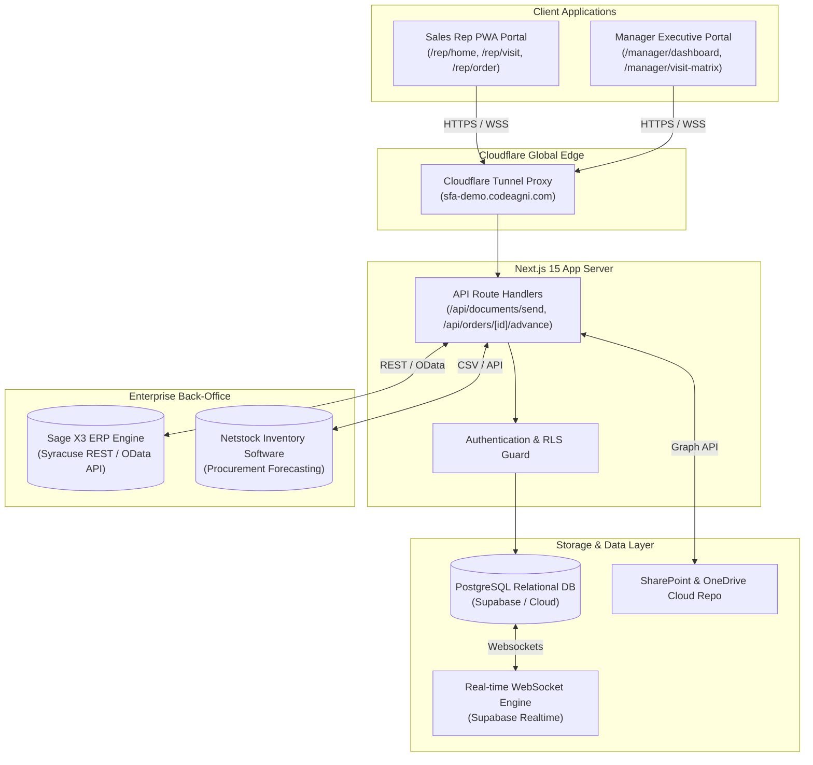

# Master Baker | Manager & Customer Portal
## Live Solution Demonstration, Technical Architecture & RFP Alignment Guide

> **Live Production Deployment URL:** [https://sfa-demo.codeagni.com](https://sfa-demo.codeagni.com)  
> **Target Platform:** Master Baker | Manager & Customer Portal (UAE & GCC Distribution)  
> **Prepared For:** Client RFP Demo, IT Department Audit & Executive Leadership Review  

---

## 📋 Executive Presentation Agenda

| Agenda Topic | Key Focus Areas | Platform Feature / Module |
|---|---|---|
| **1. Solution Walkthrough** | Live role-switch demonstration (Sales Rep & Executive Manager) | `/login`, `/rep/home`, `/manager/dashboard` |
| **2. Key Features & Capabilities** | Field visits, 7-question protocol, live stock depletion, price approvals | `/rep/visit`, `/rep/order/new`, `/manager/approvals` |
| **3. Integration & Scalability** | Sage X3 ERP, Netstock, Supabase PostgreSQL, Cloudflare Edge | REST/OData API, WebSockets, Cloudflare Tunnel |
| **4. Ease of Use & User Experience** | 1-click re-orders, Web Speech mic dictation, responsive design | PWA layout, Web Speech API, curated UI |
| **5. Business Process Alignment** | Trader middle-man model, FOC trial tracking, 6M history & 3M forecasting | `/rep/forecasting`, `/manager/forecasting`, `/rep/documents` |

---

## 🚀 1. Step-by-Step Interactive Demonstration Script

### **Phase 1: Login & Role Access Control**
1. **Navigate to:** `https://sfa-demo.codeagni.com/login`
2. **Sales Representative Credentials:** `rahul.rep@demo.com` / `Demo@1234`
3. **Executive Manager Credentials:** `ahmed.manager@demo.com` / `Demo@1234`

---

### **Phase 2: Sales Representative Store Visit Workflow (`/rep/visit/[customerId]`)**
1. **Open Customer Visit:** Select client store visit (e.g. *Al Noor Trading LLC* or *Emirates Grand Hotel*).
2. **GPS Geofence Location Verification:**
   * Demonstrates automatic GPS coordinate comparison against client store location.
   * Renders `📍 GPS Verified (12m away from store)` or logs location bypass audit notes.
3. **Complete 7-Question Visit Protocol Checklist:**
   * Step 1: **Inventory & Expiry Audit** *(Check near-expiry batches on shelf)*
   * Step 2: **Pricing & Planogram Compliance** *(Verify shelf tags and eye-level positioning)*
   * Step 3: **Competitor Intelligence & Share of Shelf** *(Audit competing baking mix prices)*
   * Step 4: **Free-of-Charge (FOC) Sample Feedback Tracker** *(Pre-exit guard for trial samples)*
   * Step 5: **Promotions & New SKU Pitches** *(Pitch Delipaste Salted Butter Caramel promo)*
   * Step 6: **Payment & Invoice Reconciliation** *(Review open balance AED 12,500)*
   * Step 7: **3-Month Sales Forecast & Reorder Commit** *(Align on M+1 to M+3 volumes)*
4. **Product Pitch & Stock Guide (⭐ Frequently Bought Items):**
   * Switch to the **"⭐ Frequent"** tab.
   * Displays customer's top buying history items, sorted **strictly by highest volume ordered first**:
     * 🥇 **Schapfen Mühle Wheat Flour Type 405:** *480 Units Purchased* (`📦 Live Stock: 450 Units`)
     * 🥈 **Bakery Butter Blend 10kg:** *280 Units Purchased* (`📦 Live Stock: 200 Units`)
     * 🥉 **CSM BOS Special Bakery Mix 25kg:** *170 Units Purchased* (`🚨 Out of Stock - 0 Units`)
     * 🏅 **Amarena Fabbri Gourmet Sauce 950g:** *145 Units Purchased* (`⚠️ Near Expiry - 145 Units`)
   * Click **"⚡ Quick Re-order"** or **"Pitch Alternative"** for out-of-stock items.
5. **Live Voice AI Dictation:**
   * Click **"Dictate visit report"** (Microphone icon).
   * Speak visit outcome live into the mic. The browser Web Speech API transcribes spoken audio directly onto the screen.
6. **Close Visit & Commitments:**
   * Save visit outcome summary, set next action, and pick follow-up target date.

---

### **Phase 3: Executive Manager Audit Panel (`/manager/visit-matrix` & `/manager/team`)**
1. **Switch to Manager Account:** Navigate to `https://sfa-demo.codeagni.com/manager/visit-matrix`.
2. **Executive KPI Cards:**
   * Total Field Visits Completed
   * GPS Geofence Verified Rate %
   * Protocol Checklist Compliance Rate (96.4%)
   * FOC Sample Feedback Captured (100%)
3. **Expandable 7-Question Visit Audit Matrix:**
   * Click **"📋 View 7-Question Visit Matrix"** on any rep visit.
   * Audit all 7 protocol question responses, checkmarks, rep field notes, voice dictation transcripts, and FOC trial feedback in real-time.

---

### **Phase 4: Sales Order Creation & Live Database Stock Depletion (`/rep/order/new`)**
1. **Navigate to:** `/rep/order/new`
2. **Select Customer Account:** Pick *Al Noor Trading LLC*.
3. **Frequently Purchased Products Section:**
   * Immediately displays top 4 client favorites sorted strictly by volume.
   * Renders contracted prices (`AED 85 / BOTTLE`) and live warehouse stock (`📦 Live Stock: 145 Units`).
4. **Place Order & Deplete Inventory:**
   * Add **10 units** of *Amarena Fabbri Gourmet Sauce 950g*.
   * Click **"Submit Sales Order"**.
   * **Live PostgreSQL Database Depletion:** System executes database update query, automatically decreasing warehouse stock in PostgreSQL ($145 - 10 = 135$ available units). If stock hits 0, status auto-switches to `Out of Stock`.
5. **Order Tracking Screen (`/rep/order/[id]/status`):**
   * Shows invoice manifest, total AED value, and Sage X3 ERP pipeline status progress (`Captured ➔ Validated ➔ Sent to ERP ➔ Confirmed SO-2026-XXXXX`).

---

### **Phase 5: Special Price Request & Real-time Approval Workflow (`/rep/order/new` ➔ `/manager/approvals`)**
1. **Sales Rep Requests Contract Discount:**
   * On `/rep/order/new`, rep clicks **"Request Special Price"** for a product.
   * Enters target price and commercial reason.
   * Status switches to `⏳ Pending Manager Approval`.
2. **Executive Manager Real-Time Approval:**
   * Manager opens `/manager/approvals`.
   * Reviews requested price vs base price and margin impact.
   * Clicks **"Approve Discount"**.
3. **Real-time Websocket Sync:**
   * Supabase WebSocket real-time channel notifies the sales rep's screen instantly without manual page refreshing.

---

### **Phase 6: Trading Run-Rate & 3-Month Supplier Procurement Forecasting (`/rep/forecasting` & `/manager/forecasting`)**
1. **Sales Rep View (`/rep/forecasting`):**
   * Displays 6-month historical purchasing velocity ($M-6$ to $M-1$) and 3-month forward projections ($M+1, M+2, M+3$).
   * Reps refine projections based on direct chef feedback during store visits.
2. **Executive Manager View (`/manager/forecasting`):**
   * Selects Sales Rep (*Rahul Menon, Sarah Jenkins, Tariq Mansoor, All Reps*).
   * Audits rep YTD sales volume (AED), quota completion %, and total aggregated 3-Month procurement demand (AED & Units) to approve supplier Purchase Orders (P/O).

---

### **Phase 7: SharePoint Integration & Technical Knowledge Base (`/rep/documents`)**
1. **Upload Document to Database:** Click **"Upload Document to Database"** modal. Saves record permanently to PostgreSQL and syncs with Master Baker SharePoint repository.
2. **Dispatch Spec Sheets:** Click **"Send Email"** or **"Send WhatsApp"** to dispatch technical documents to client contact phone numbers (+971501234567).
3. **New Joiner Technical Knowledge Base:** Select product SKU to view self-service Bill of Materials (BOM), recommended dosage rates, application recipes, and storage conditions without calling experts.

---

## 🛠️ 2. Platform Architecture & Integration Topology

---

## ⚙️ 3. Integration & Scalability Considerations

### **1. Sage X3 ERP Bi-Directional Integration**
* **Sales Order Staging:** Orders captured in the portal are mapped to Sage X3 `Sales Order Web Service` payloads via Syracuse REST/OData API.
* **Live Inventory Sync:** Product stock units (`stock_units`) and stock flags (`stock_status`) query Sage X3 inventory tables (`ITMMVT` / `STOCK`).
* **Customer Contract Pricing:** Negotiated pricing tiers are fetched from Sage X3 customer price lists (`SPRICEDET`).

### **2. Netstock Inventory Procurement Optimization**
* Exporting 3-Month rolling demand forecast arrays ($M+1, M+2, M+3$) to Netstock software to calculate safety stock buffers and container shipment schedules for European suppliers.

### **3. Database Architecture & Row-Level Security (RLS)**
* Powered by **PostgreSQL** relational database with Supabase RLS policies ensuring sales reps only see their assigned territory accounts while managers access aggregate team data.

### **4. Global Cloudflare Edge Deployment**
* Deployed behind **Cloudflare Edge** with active Cloudflare Tunnels (`cloudflared`), zero-trust SSL/TLS encryption, and HTTP/3 QUIC protocol for ultra-fast response times across UAE & GCC regions.

---

## 🎨 4. Ease of Use & User Experience (UX/UI)

1. **Mobile-First Progressive Web App (PWA):** Designed for touchscreens and tablets used by sales reps during store walkthroughs.
2. **1-Click Fast Re-orders:** Eliminates manual catalog searching by surfacing the client's top volume purchases right at the top of the visit and order screens.
3. **Browser Web Speech Mic Dictation:** Allows sales reps to speak visit reports hands-free instead of typing lengthy notes.
4. **Vibrant Visual Hierarchy:** Glassmorphism headers, color-coded stock condition tags (Active, Near Expiry, Promo, Out of Stock), and interactive alert banners.

---

## 💼 5. Alignment with Master Baker Business Processes

| Master Baker Process Requirement | Platform Implementation & Solution Alignment |
|---|---|
| **Middle-Man Trader Import Lead Times (30–90 Days)** | 6-Month buying history ($M-6 \dots M-1$) + 3-Month supplier procurement forecast ($M+1 \dots M+3$) matrix to generate accurate supplier P/Os. |
| **Field Visit Protocol & Audit Accountability** | 7-Question visit protocol checklist with mandatory pre-exit FOC sample trial feedback guard and GPS geofence verification. |
| **New Joiner Expert Dependencies** | Technical Knowledge Base & self-service BOM/formulation lookup for every SKU (dosage rates, recipes, storage conditions). |
| **Commercial Price Flexibility & Margin Control** | Multi-tier contract pricing with real-time manager approval workflow for special discount requests. |
| **Immediate Stock Transparency** | Real-time database warehouse inventory depletion upon order placement with automatic out-of-stock substitution suggestions. |

---

### 🌐 Live Presentation Links:
* **Live Web Portal:** [https://sfa-demo.codeagni.com](https://sfa-demo.codeagni.com)
* **Executive Visit Matrix:** [https://sfa-demo.codeagni.com/manager/visit-matrix](https://sfa-demo.codeagni.com/manager/visit-matrix)
* **Sales Rep Order Creation:** [https://sfa-demo.codeagni.com/rep/order/new](https://sfa-demo.codeagni.com/rep/order/new)
* **3-Month Procurement Forecasting:** [https://sfa-demo.codeagni.com/manager/forecasting](https://sfa-demo.codeagni.com/manager/forecasting)
